<!-- HEADER ANIMATION -->

<h1 align="center">👋 Hi, I'm Zuko</h1>
<h3 align="center">Software Developer | Backend Engineer in Progress | Cloud & Cybersecurity Enthusiast</h3>

<!-- TYPING ANIMATION -->

  

 

## 🚀 About Me

I'm a software developer passionate about building reliable backend systems, cloud solutions, and cybersecurity tools that solve real world problems.

Currently sharpening my skills through **WeThinkCode_**, focusing on strong software engineering fundamentals, clean code practices, object-oriented programming, and building practical applications.

My goal is to become a backend-focused engineer who understands not only how to build software, but also how to deploy, secure, and scale it.

---

## 🎯 Current Focus

- ☕ **Java & Object-Oriented Programming**
- ⚙️ **Backend Development & REST APIs**
- ☁️ **Cloud Computing (AWS & Oracle Cloud)**
- 🔐 **Cybersecurity & Secure Application Development**
- 🗄️ **Database Design (PostgreSQL & MySQL)**
- 🐳 **Docker & System Deployment**

---

## 🛠️ Tech Stack

  

---

## 📂 Current Projects & Learning Journey

### ☕ Java Development
- Object-oriented programming projects
- Design patterns and clean architecture practice
- Console applications and backend systems

### ⚙️ Backend Engineering
- REST APIs
- Database integration
- Server-side application development

### ☁️ Cloud Computing
- AWS fundamentals
- Oracle Cloud Infrastructure
- Cloud deployment concepts

### 🔐 Cybersecurity
- Security-focused projects
- Exploring vulnerability awareness
- Building safer software systems

---

## 🔥 Current Mission

Building projects that combine:

**Software Engineering + Backend Development + Cloud Infrastructure + Cybersecurity**

Every repository represents another step towards becoming a better engineer.

> "Every commit is another step toward becoming a better engineer."

---

## 📊 GitHub Stats

<!-- fixed: github-readme-stats.vercel.app's public deployment is now permanently paused (project is unmaintained,
     see anuraghazra/github-readme-stats#4867), so the stats/top-langs cards below now come from the new
     stats.yml Action (same pattern as snake.yml) which renders them to static SVGs committed under profile/.
     streak-stats.demolab.com is a separate service and was still working fine, left as-is. -->

  
  

  

---

## 🐍 Contribution Snake

  <!-- fixed: snake.yml pushes dist/*.svg to the ROOT of the output branch (crazy-max/ghaction-github-pages strips the dist/ prefix), so the old "output/dist/..." path 404'd -->
  

---

## 📚 Currently Learning

- 🌱 Java Backend Development
- 🌱 System Design Fundamentals
- 🌱 Cloud Architecture
- 🌱 Secure Software Development
- 🌱 DevOps Practices

---

## 🤝 Connect With Me

  
  

 

🚀 Always learning. Always building.

<!-- FOOTER -->

